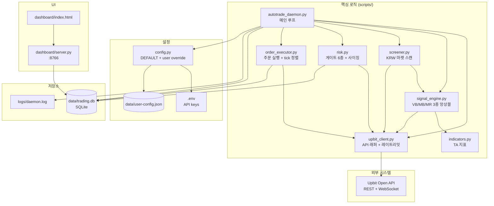
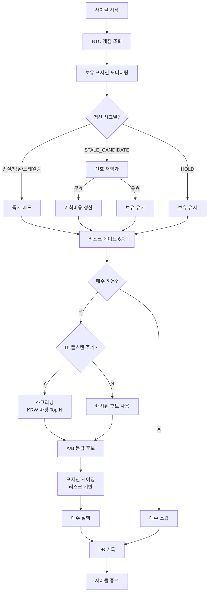
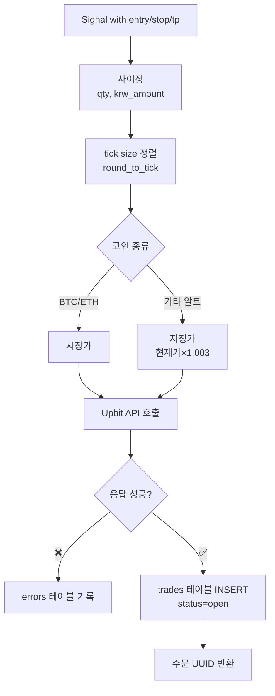
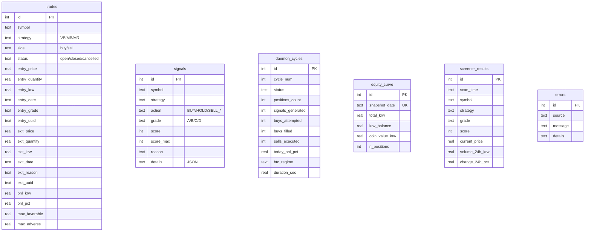

# 시스템 아키텍처

## 컴포넌트 다이어그램

## 데몬 사이클 흐름

## 주문 실행 흐름

## DB 스키마

## 레이트리밋 관리

| API 종류 | 공식 한도 | 이 시스템 설정 |
|---------|----------|----------------|
| 주문 | 초 8 / 분 200 | 초 6 (여유) |
| 시세 | 초 10 / 분 600 | 초 8 (여유) |
| WebSocket | 초 5 / 분 100 | 미사용 (REST만) |

`upbit_client.py:RateLimiter` 가 sliding window로 관리.

## 파일 역할 요약

| 파일 | 책임 |
|------|------|
| `config.py` | 설정 기본값 + user-config.json 병합 |
| `upbit_client.py` | API 호출 단일 진입점 (재시도/레이트리밋/dry_run 분기) |
| `indicators.py` | 기술 지표 순수 함수들 |
| `signal_engine.py` | 3종 전략 평가 + 청산 시그널 |
| `screener.py` | KRW 마켓 전체 스캔 |
| `risk.py` | 게이트 + 포지션 사이징 |
| `order_executor.py` | 주문 실행 + DB 반영 |
| `autotrade_daemon.py` | 메인 루프 |
| `backtest.py` | VB 전략 백테스터 |
| `db.py` | SQLite 헬퍼 |
